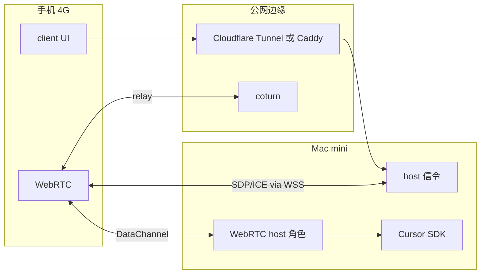

# PRD：webrtc-ai-console

**版本**：0.2（原型）  
**更新**：2026-06-01  
**负责人**：待定  

---

## 1. 背景与问题

用户希望把 **手机** 当作随时可用的轻量控制台，把 **Mac mini** 当作常驻算力节点：在手机上用自然语言发指令，Mac 在本地执行 AI 任务（读写仓库、跑 Agent、工具调用），并把进度与结果 **实时** 回传到手机，而无需每次打开 Cursor IDE 或 SSH。

现有方案痛点：

| 方案 | 痛点 |
|------|------|
| SSH + 终端 | 手机体验差，无流式 UI |
| 远程桌面 | 重、费流量、不适合纯文本指令 |
| 纯 HTTP API | 需公网暴露 Mac，延迟与鉴权复杂 |
| 第三方 IM Bot | 数据出境、难以绑定本地代码库 |

**思路**：用 **WebRTC DataChannel** 建立手机与 Mac 的数据通道；经 **信令（WebSocket）** 交换 SDP/ICE；Mac 侧用 **Cursor SDK 本地 Runtime** 跑 Agent 并流式回写。跨网场景配合 **WSS + 房间令牌 + TURN**。

---

## 2. 产品定位

| 维度 | 描述 |
|------|------|
| 一句话 | 手机 ↔ Mac mini 的 P2P 聊天式 AI 控制台 |
| 用户 | 开发者本人（单用户 / 小团队原型） |
| 场景 | 通勤/外出（4G）发指令；Mac 在家或本机执行 Agent |
| 非目标（v0） | 多租户 SaaS、语音通话、屏幕共享、App Store 上架 |

### 2.1 部署形态（v0.2）

| 形态 | 信令 | 媒体/DataChannel | 典型用途 |
|------|------|------------------|----------|
| **局域网** | `ws://Mac:8787/ws` | 直连或 STUN | 家里 Wi‑Fi 开发 |
| **Cloudflare Tunnel** | `wss://*.trycloudflare.com/ws` | 需另配 TURN 才能稳定 4G | 临时公网、**用完即关** |
| **VPS 正式** | `wss://自有域名/ws` + Caddy | coturn TURN | 长期 4G 使用 |

> **原则**：信令隧道（Cloudflare）**可随时关闭**（停止 `cloudflared` 即断开公网）；不等于长期把 Mac 端口暴露到互联网。

---

## 3. 用户故事

### US-1 发指令并看到流式回复

**作为** 手机端用户  
**我希望** 在聊天窗输入自然语言任务  
**以便** Mac 本地 Agent 执行后，我能逐字看到回复。

**验收**：

- 首个 `chat.assistant.delta` 在合理时间内出现（受 Agent 冷启动影响）
- 有 `chat.assistant.done` 且带 `runId`

### US-2 局域网一键配对

**作为** 用户  
**我希望** 手机和 Mac 在同一 Wi‑Fi 下用同一 **房间 ID** 连接  
**以便** 无需端口转发。

**验收**：

- 相同 `roomId` 后 `WebRTC: connected`，DataChannel 可发消息
- 聊天内容不经信令持久化

### US-3 外网（4G）连接

**作为** 用户  
**我希望** 手机用 4G 也能连上家里的 Mac 控制台  
**以便** 不在同一 Wi‑Fi 也能发指令。

**验收**：

- 信令使用 **WSS** 且校验 **房间令牌**
- join 成功后收到 `joined.iceServers`（含 TURN 时 4G 可建立 `relay` 候选）
- 部署文档（DEPLOY）中 **Cloudflare 临时隧道** 步骤可在 30 分钟内跑通信令

**非验收（v0.2）**：仅隧道、无 TURN 时 4G 必须成功（受 NAT 限制，文档需说明）。

### US-4 随时关闭公网暴露

**作为** 用户  
**我希望** 用完控制台后关闭公网入口  
**以便** 降低被扫描、滥用的风险。

**验收**：

- 停止 `cloudflared`（或 VPS 上的 host）后，原 WSS 地址不可再 join
- README/DEPLOY 明确写出「Ctrl+C / 停服务」即关

### US-5 Mac 掉线可感知

**作为** 手机端用户  
**我希望** Mac 休眠或进程退出时看到断开  
**以便** 不会误以为 AI 仍在执行。

**验收**（目标，M4 强化）：

- 信令断开或 `peer-left` 后 UI 有明确状态

---

## 4. 系统架构

### 4.1 逻辑组件（外网）

### 4.2 信令 vs 数据 vs AI

| 层 | 技术 | 内容 |
|----|------|------|
| 信令 | WebSocket `/ws`（WSS 公网） | `join` → `joined`；`offer`/`answer`/`ice-candidate` |
| 数据 | SCTP DataChannel `chat` | `chat.user`、`chat.assistant.*` |
| AI | `@cursor/sdk` local | `Agent.create` + `agent.send` + `run.stream()` |
| 中继 | TURN（coturn） | 4G / 对称 NAT 时 DataChannel 走 relay |

### 4.3 角色约定

| 角色 | 端 | 行为 |
|------|-----|------|
| `mobile` | 手机浏览器 | offer 发起方 |
| `host` | Mac 浏览器（v0）或未来无头 Node | answer 方；**唯一** 调 SDK |

每房间每角色 **最多 1 个**  peer；满员返回 error。

---

## 5. 功能需求

### 5.1 M1 — 最小 WebRTC 聊天（P0）

| ID | 需求 | 状态 |
|----|------|------|
| F1.1 | WebSocket 信令：join、转发 SDP/ICE | ✅ |
| F1.2 | DataChannel 双向文本 | ✅ |
| F1.3 | 聊天 UI + 连接状态 | ✅ |
| F1.4 | host 侧 echo 验证 | ✅（浏览器 host） |

### 5.2 M2 — Cursor SDK（P0）

| ID | 需求 | 状态 |
|----|------|------|
| F2.1 | `chat.user` → `Agent.send` | 待做 |
| F2.2 | `run.stream()` → `chat.assistant.delta` | 待做 |
| F2.3 | `run.wait()` → `chat.assistant.done` | 待做 |
| F2.4 | 区分启动失败 vs 运行失败 | 待做 |
| F2.5 | `AGENT_CWD` / model 配置 | 待做 |
| F2.6 | 串行队列 / `BUSY` | P1 |

### 5.3 M3 — 公网与安全（P0/P1）

| ID | 需求 | 优先级 | 状态 |
|----|------|--------|------|
| F3.1 | `ROOM_ACCESS_TOKEN` join 校验 | P0 | ✅ |
| F3.2 | `joined` 下发 `iceServers`（STUN/TURN） | P0 | ✅ |
| F3.3 | coturn + 短时 TURN 凭证（`TURN_AUTH_SECRET`） | P0 | ✅ 配置级 |
| F3.4 | 连接页：信令 URL、令牌、localStorage | P0 | ✅ |
| F3.5 | `/api/ice?token=` REST | P1 | ✅ |
| F3.6 | DEPLOY：VPS / **Cloudflare Tunnel** 文档 | P0 | ✅ |
| F3.7 | 断线重连 | P1 | 待做 |
| F3.8 | 消息长度限制 / 速率限制 | P2 | 待做 |

### 5.4 M4 — 运维与体验（待规划）

| ID | 需求 |
|----|------|
| F4.1 | host 无头化（Node `wrtc` 或常驻 Chromium） |
| F4.2 | Cloudflare Named Tunnel 示例 `config.yml` |
| F4.3 | 健康检查与简单监控 |

---

## 6. 协议规范

### 6.1 DataChannel（应用层）

与 v0.1 相同：`chat.user`、`chat.assistant.delta`、`chat.assistant.done`、`chat.error`。  
类型：`packages/shared/src/protocol.ts`。

### 6.2 信令（WebSocket）

| type | 方向 | 说明 |
|------|------|------|
| `join` | C→S | `{ roomId, role, token? }` |
| `joined` | S→C | `{ roomId, role, iceServers[] }` |
| `offer` / `answer` | C↔C 经 S 转发 | `{ sdp }` |
| `ice-candidate` | C↔C 经 S 转发 | `{ candidate }` |
| `peer-left` | S→C | 对端离开 |
| `error` | S→C | `{ message }` |

**ICE 项**：`{ urls, username?, credential? }`；TURN 凭证由 host 按 coturn `static-auth-secret` 算法生成。

---

## 7. 非功能需求

| 类别 | 目标 |
|------|------|
| 延迟 | 信令 RTT < 200ms（公网隧道可放宽）；首 token 取决于 Agent |
| 可用性 | host / cloudflared 停止后，客户端无法 join（见 US-4） |
| 隐私 | 聊天与 Agent transcript 默认留在 Mac；信令不存消息体 |
| 安全 | 公网必须 token + WSS；隧道临时 URL 仍须 token；TURN 密钥不入库 |
| 可观测 | `runId` / `agentId` 写 host 日志；`/health` 暴露 turn/auth 配置状态 |

---

## 8. 技术选型

| 项 | 选择 | 理由 |
|----|------|------|
| monorepo | pnpm workspace | 共享协议类型 |
| client | Vite + TS | 移动浏览器友好 |
| host | Node 20 + `ws` | 信令 + SDK（TS） |
| 公网信令（开发） | **Cloudflare Tunnel** | 免费 WSS、可随时关闭 |
| 公网信令（生产） | Caddy + 自有域 | 稳定证书 |
| TURN | coturn | 标准、与临时凭证算法一致 |
| AI | `@cursor/sdk` local | 本机仓库与工具链 |

### 8.1 隧道方案对比（仅信令）

| 方案 | 推荐度 | 说明 |
|------|--------|------|
| **Cloudflare Tunnel** | ⭐ 首选 | WSS 自动；可升级 Named Tunnel；停进程即关 |
| ngrok | 可选 | 上手快，免费 URL 常变、有限流 |
| localhost.run | 仅临时 | 最省事，不适合稳定 WebRTC 联调 |

**共同限制**：均 **不转发 TURN UDP**；4G 仍需独立 coturn 或第三方 TURN。

---

## 9. 风险与对策

| 风险 | 影响 | 对策 |
|------|------|------|
| 仅隧道、无 TURN | 4G WebRTC failed | PRD/US-3 写清；DEPLOY 要求 TURN |
| 隧道 URL 泄露 | 他人尝试 join | 强制 `ROOM_ACCESS_TOKEN`；用完关 cloudflared |
| 对称 NAT | P2P 失败 | `joined` 含 TURN；chrome://webrtc-internals 查 relay |
| Mac 休眠 | 无响应 | US-5；未来 WoL 不在 scope |
| Agent 并发 | 资源耗尽 | F2.6 串行 |
| API Key 泄露 | 账号风险 | `.env` gitignore |

---

## 10. 成功指标（原型）

- [ ] 局域网：10 轮 echo/对话无错乱
- [ ] Cloudflare 隧道：手机 4G 能 join 且信令 `joined` 成功
- [ ] 配 TURN 后：4G 出现 `relay` 候选且 DataChannel 可用
- [ ] 停止 cloudflared 后，旧 URL 无法连接（US-4）
- [ ] 至少 1 次真实 Cursor Agent 流式端到端（M2）
- [ ] 新人按 README 30 分钟内跑通局域网；按 DEPLOY 跑通隧道信令

---

## 11. 里程碑

| 里程碑 | 交付物 | 状态 |
|--------|--------|------|
| M0 | README、PRD、骨架 | ✅ |
| M1 | Echo + 信令 + UI | 🚧 |
| M2 | SDK 流式 | 待做 |
| M3 | token、ICE、`joined`、TURN 文档、连接页 | ✅ 首版 |
| M3+ | Cloudflare 详细步骤、Named Tunnel 示例 | 文档 ✅ |
| M4 | 重连、无头 host、限流 | 待做 |

---

## 12. 开放问题

1. **host 无头化**：Node `wrtc` vs Mac 上常驻浏览器？  
2. **TURN 放哪**：与信令同 VPS vs 家里 Mac 旁路？  
3. **仅 Cloudflare、无 VPS**：是否接受第三方 TURN SaaS 配额？  
4. **工作目录**：固定 repo vs 消息内 `cwd`？  
5. **多轮上下文**：单 Agent 会话 vs 每消息 `Agent.prompt`？（倾向单会话 + `agent.send`）

---

## 附录 A：Cursor SDK 映射

（同 v0.1，见 `packages/host/src/agent/run-user-message.ts`。）

---

## 附录 B：Cloudflare 临时隧道（产品侧约定）

1. Mac 运行 `pnpm dev:host`，配置 `ROOM_ACCESS_TOKEN`。  
2. 运行 `cloudflared tunnel --url http://localhost:8787`。  
3. 手机与 Mac 使用 `wss://<分配域名>/ws` + 相同令牌与房间。  
4. 结束使用后 **终止 cloudflared**；可选同时停止 `dev:host`。  

实现细节：[DEPLOY.md](./DEPLOY.md) 方案 B。
